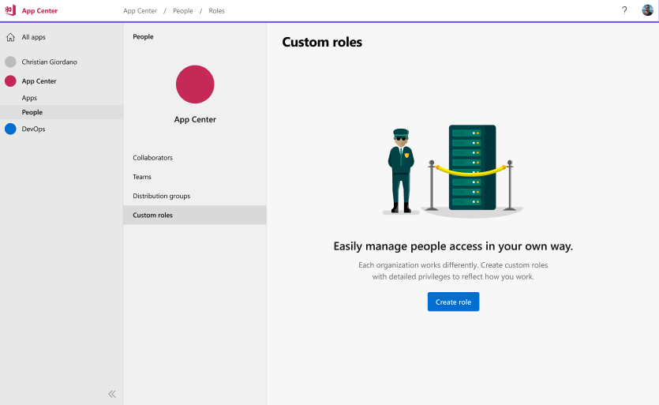
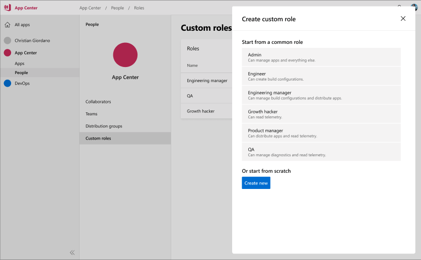
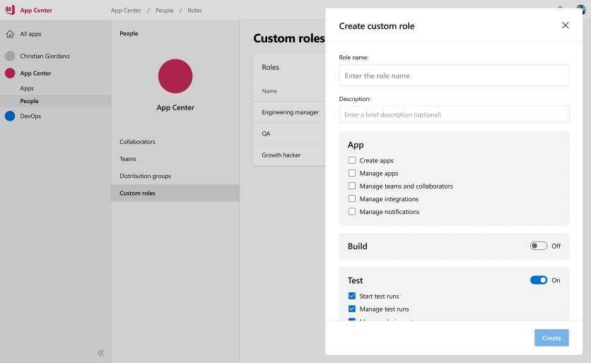

# Overview

App Center has roles that can only be applied broadly across all the services within the portal and through the API's.

## Built-in Roles Today

There are currently two categories of roles within App Center, Organization roles and Team roles. Team roles determine app permissions which define what a user can do with an app's configuration and data, but we frequently hear requests for more options.

### Organization Roles

There are two roles within an organization, which determine access across all apps and settings within an organization.

* Admins manage the settings of an organization (name, permissions, billing configuration). They also automatically have 'Manager' level app permissions for all apps within the Org
* Collaborators are able to create apps, making them the manager of that app, and create teams within an Organization. Collaborators only work within apps they own or are members of.

### Team Roles

Teams exist within the context of an Organization, and a single organization can have multiple teams. Your role within a team determines what a user can do with an apps configuration and data.

* Managers can manage app settings, collaborators, and integrations
* Developers can manage app services (e.g. create builds, run tests)
* Testers can install apps they are distribution group members of
* Viewers access is limited to a read-only state for all app data

# Goals

Introduce new role based access controls for App Center services, user scenarios, and functionality with a strong focus on ease of use over maximum granularity.

# Scenarios

## Roles

1. Admins can create, update and delete additional roles
2. Admins cannot create, update and delete the 4 built-in default roles
3. Admins can edit a roles permissions

## Role Permissions

Custom roles will include the ability to include or exclude access to a specific service along with a permission set focused on functionality within the service itself.

### Apps

 1. Apps can be created
 2. Apps can be deleted
 3. Can manage Teams & Collaborators
 4. Can set up integrations (services, webhooks, export)
 5. Can remove integrations (services, webhooks, export)
 6. Can manage all notification settings

### Build

 1. Can create build configuration
 2. Can delete build configuration
 3. Can start a build
 4. Can delete a build
 5. Can view build logs

### Test

  1. Can start test run
  2. Can view test run
  3. Can delete test run
  4. Can manage device sets
  
### Distribution

  1. Can distribute release
  2. Can manage distribution groups
  3. Can delete release
  4. Can view distribution statistics
  
### Diagnostics

  1. Can delete issues
  1. Can view diagnostics
  
### Analytics

  1. Can view analytics
  2. Can manage export
  
### Push

  1. Can send push messages

### Identity

  1. Can create identity tenant
  2. Can configure identity tenant
  3. Can delete identity tenant
  4. Can view user details
  
# GDPR

  1. Can submit DSR delete requests
  2. Can submit DSR export requests

## Teams

With an existing `Team` structure already in place the assumption is this serves as a logical fit for security group management.

1. Admins can create a `Team` and limit the services members have access to see
2. Admins can create a `Team` and limit functionality within a service members have access to use

## App Security

1. Admins can lock down an app to users belonging to a specific corporate domain
2. Admins can lock down an org to users belonging to a specific corporate domain
3. Admins can secure app releases behind an authenticated web address

## Audit

1. Admins, developers and viewers can view an audit trail of actions performed by users within an app or org

# Mockups
Default view when no custom roles have been created:

List view of custom roles you've created underneath your org or app:

Create a new role from a few predefined templates:

Modify access to services and management features:

Granular permissions across all App Center services:

1. Admins can create, update and delete additional roles
